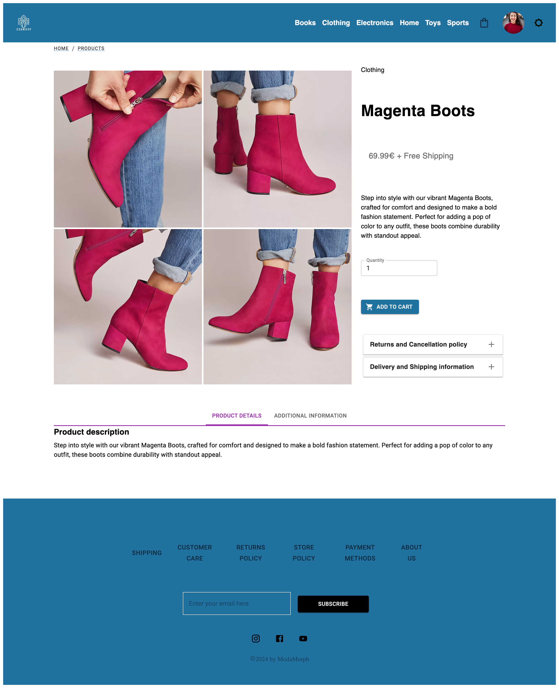

# Welcome to Modamorph - One stop destination for your Online Shopping

## Technologies used:

**ModaMorph** is a e-commerce application that enables people to shop a range of products from Clothes,Electronics,Furnitures,Shoes & Miscellenous categories.
**ModaMorph** is built using `React` and [Asp.Net Core Framework](https://modamorph.azurewebsites.net/swagger/index.html).
This is a multi page application with all code written in `Typescript` and all styles in `MaterialUI` for front end and the backend with Asp.Net core.
ModaMorph is equipped with `accessibility` and `responsiveness` for Small screen upto 650px Medium Screen upt0 900px, Large screen upto 1024 and extra large 1200px and up.

**Purpose -** At **Modamorph**, our main purpose is to redefine the online shopping experience for our valued customers. Whether you're a tech-savvy individual, a busy professional, or a discerning shopper seeking the latest trends, our platform caters to all your needs with a user-friendly interface and a diverse array of products.

**Audience -** Our target audience includes a wide range of consumers, who are looking to buy products online sitting from comfort of home. By offering selection of items, listing from electronics and fashion to miscelleneous goods like perfume and so, we strive to meet the diverse demands of modern-day shoppers.

The site not only facilitates consumers to buy products online, but also enables business admins/backend agents to administor products, users and range of other things.

Just dive into **[Modamorph](https://shop-modamorph.netlify.app/)** to see it in live!

## Table of contents

- [Getting started](#getting-started)
  - [Prerequisites](#prerequisites)
  - [Installation](#installation)
  - [Set up the environment](#set-up-the-environment)
  - [Installation steps](#installation-steps)
  - [Start application](#starting-the-application)
- [Usage](#usage-guidelines)
  - [Available scripts](#available-scripts)
  - [How to use](#how-to-use)
  - [Features](#features)
  - [Screenshots](#screenshots)
- [Architecture & design](#architecture-and-design)
  - [Module structure](#module-structure)
  - [Data flow](#data-flow)
  - [Component structure](#components-structure)
- [Testing](#testing)
  - [Run automated tests based on `jest` test framework](#run-automated-tests)
- [Acknowledgement](#acknowledgement)

## Detailed information and instructions

## Getting started

### Prerequisites

List the software, tools, and versions you need to run the project.

### Installation

- Clone the repo: to clone run below in terminal

`git clone git@github.com:koyenadey/fs17-Frontend-project.git`

### Set up the environment

If you have already configured local git installation to be used with github, gitlab etc. then no separate setup needed, otherwise you can follow [this](https://git-scm.com/book/en/v2/Getting-Started-First-Time-Git-Setup) for more info

In case any help with `ssh` setup, follow [this](https://docs.github.com/en/authentication/connecting-to-github-with-ssh) link

### Installation steps

To run ModaMorph application, first clone the repository as [mentioned](#installation) then we will need to install required dependencies.

To install dependencies:

- Open terminal and navigate to cloned repository folder
- Run `npm install` or `npm i`

### Starting the application

To start ModaMorph application, type below in terminal

`npm start`

## Usage Guidelines

### Available Scripts

`npm test` - To run the automated using Jest Library.

`npm start` - To run the application in your local

`npm build` - To build the application to deploy to the production.

### How to use

- To check admin features login using email `caroles.castro@mail.com` & password **Admin123** or `john.doe@mail.com` & password **Admin123**

- Typing a product `name` in the search box fetches the result if found.

- Data is by default sorted in `ascending order by title` but can also be sorted in `descending/ ascending order` on `price` field. Sorting is done dynamically by backend api on `title` or `price`.

- To check the backend API [refer here](https://github.com/koyenadey/ECommWebApi)

- Clicking on the logo navigates to the home page.

- Clicking on the person icon on the navigation bar will show the option of logging in or to see details related to the application like `About Us`,`Shipping & Returns`,`Customer Care`, `Profile`, `Login`, `Dashboard`.

- Profile is only available after you login.

- Dashboard is available only for admin.

- An admin can add product, modify it and delete the products.

- Clicking on cart icon takes you to the cart page.

- Clicking on menu icon shows all the categories of products and `All Products`. Clicking on categories takes you to the product page with all the products listed under the category selected.

- Clicking eye button on the product navigates to the details page where all the details pertaining to the product could be found.

- The product details has option to add the item to the cart and select the quantity.

- Adding product automatically updates the quantity in the cart bag icon and takes you to the cart page.

- The cart page has ability to update the quantity of the items and even delete the item from the cart.

### Features

ModaMorph uses the following features -

- **Searching** : ModaMorph is enabled to search data accross the data set and is enabled with `Lazy Loading` and `debounce` features for performance optimisation.

- **Sorting** : ModaMorph is enabled to sort the data based on **brewery name** in both `ascending` and `descending order`. This feature also supports `Lazy Loading`

- **Pagination** : ModaMorph is enabled to **progressive pagination** based on search / sort functionalities accordingly.

- **ScrollToTop** : ModaMorph is enabled to **progressive traversal** based on the options selected accordingly. Selecting `AboutUs` traverses to the exact location of the paragraph where it is situated in the Page and not a generic location.

- **Filtering** : ModaMorph is enabled to **filter** products based on the categories selected. Selecting `Clothes` show the products pertaining to that category only.

- **LazyLoading** : ModaMorph is enabled to **lazy load** components based on the navigation. Only the Home component is loaded by default because it is the landing page. Rest of the components are loaded on demand. This increases the efficieny of the application.

- **Redux** : The application's state is centrally managed by the Redux store, offering several advantages. By utilizing Redux, we mitigate prop drilling, ensuring a cleaner and more maintainable codebase. Additionally, it establishes a single source of truth for the application's data, enhancing predictability and simplifying state management across components. This approach streamlines development and fosters scalability, ultimately contributing to a more robust and efficient application architecture.

- **DarkMode** : The application is having the feature to switch to dark and light modes in the navigation bar,menu & footer.

### Screenshots

`Home Page Web view`

`Home Page Mobile view`

`Login Page`

`Products Page - All Products`

`Product Details`

`User Address Web Layout`

`User Address Mobile Layout`

`Cart Page`

`Admin Page`

`About Us Page`

## Architecture and design

### Module Structure

This project is structured into sub-directories under **src:** `components`,`constants`,`context`,`data`, `hook`, `images`, `misc`, `pages`,`redux`,`styles`,`test`,`utils`

### pages

ModaMorph hosts all the pages of the application. Currently there are pages for `Home`, `DashBoard`,`Login`,`ProductsPage`,`ProductDetails`,`Profile`,`Register`and `AboutUs`

## Data flow

## Components structure

ModaMorph hosts all the visual components of the UI layer. The project utilizes `custom react hooks`, `react hook form`, `debounce` for efficiency, optimization and `react router dom` for routing. This project also utilizes the power of private routes which is essential for the privacy and security of the application. Private routes ensure that sensitive information and restricted content are accessible only to authorized users, enhancing the overall confidentiality and integrity of the application. Most of the major pages are wrapped by a `Master Page` component for enhanced layout.

### Home

This is the landing page with navigation bar and footer. It also has menu and option to switch to dark mode.

### DashBoard

This page is available only for the admins. Once a user who is admin logs in can see the dasboard that has list of all users and products and can add, delete or update products.

### Login

This page is used for Login to the application using email & password and also has a option to register if new user.

### Register

This page is used to register a user in the application using email and a password. Currently google login is not available, but it will be available in the upcoming features.

### ProductsPage

This page is responsible for listing all the products pertaining top a category selected or All products if selected. Each product listed has an eye button that redirects to the details page where user can added the product to the cart.

### Profile

This page is only available if the user logs in and can be customer or admin. This page is available to both and they can update their name or email information is they want to.

### AboutUs

This page contains the history of the application and few FAQs like Shippinmg information and all.

### hooks

ModaMorph hosts all the custom hooks used in the application. Currently there are hooks like `useFetchUsers`,`useFetchUser`,`useFetchProducts` to fetch the data accross the application.

### utils

ModaMorph hosts all the utility function used in the application.

### misc

ModaMorph hosts all the types related to the application.

## Testing

### Run automated tests

Automated testing is done using **jest** testing library.

To run tests open terminal and run below from project folder
`npm test`

## Deployment

This project is deployed and hosted on netlify platform. Deploying a React project to Netlify is a straightforward process thanks to its seamless integration with Git.

### Acknowledgement

I would like to thank my teacher Alia, Maryam & Andrea for unwavering support and
providing us with knowledge required.
